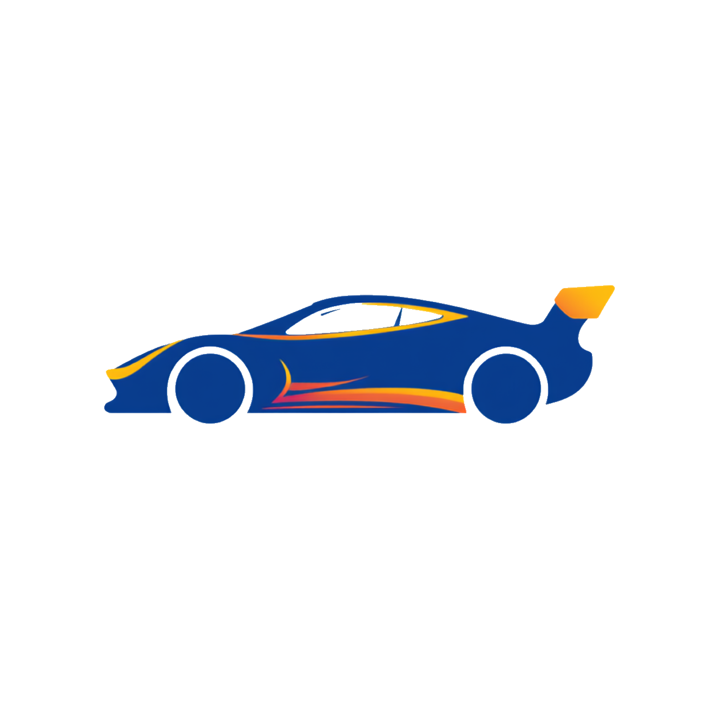

<p align="center">
  
</p>

<h1 align="center">DieCastCollectionTracker</h1>

<p align="center">
  A self-hosted web app for tracking your die-cast car collection — what you own, what you want,
  and what it's worth — with photos, filters, and offline browsing.
</p>

<p align="center">
  <a href="https://github.com/wwwescape/DieCastCollectionTracker/releases"></a>
  <a href="https://github.com/wwwescape/DieCastCollectionTracker/commits/master"></a>
  <a href="https://github.com/wwwescape/DieCastCollectionTracker"></a>
</p>

## Features

- **Collection tracking** — owned cars and a wishlist, with manufacturer, series, vehicle type,
  color, cast and collection numbers, year, condition (Mint in Box to Poor), quantity, purchase
  price, notes, and tags.
- **Photo gallery** — several photos per car, with a primary photo for the card.
- **Search & filters** — filter by manufacturer, series, vehicle type, color, or status.
- **Your own lookup lists** — manufacturers, series, vehicle types, and colors grow as you type,
  and can be managed on their own page.
- **Dashboard** — collection stats by manufacturer and vehicle type, plus recently added cars.
- **Undo deletes** — a 5-second grace window before a delete is applied.
- **Data portability** — CSV export, plus full JSON backup and restore.
- **PWA** — installable, and works offline for anything you've already viewed (including car
  photos).
- **Material 3 design** — light and dark mode, and responsive navigation for phone, tablet, and
  desktop.
- **Single admin, self-hosted** — no public registration, no multi-tenancy.

## Installation

The published Docker image bundles the frontend and backend into a single container, with
SQLite, so no separate database service is needed. Create a `docker-compose.yml`:

```yaml
services:
  app:
    image: wwwescape/diecastcollectiontracker:latest
    container_name: diecastcollectiontracker
    ports:
      - "8000:8000"
    env_file:
      - .env
    volumes:
      - db-data:/app/backend/db
      - uploads-data:/app/backend/uploads
    restart: unless-stopped

volumes:
  db-data:
  uploads-data:
```

Create a `.env` file next to it (see [Configuration](#configuration)), then start it and create
your admin account:

```bash
docker compose up -d
```

```bash
docker compose exec app python -m scripts.create_admin --username admin
```

Open `http://localhost:8000` and log in. Migrations run automatically on startup, and your
database and car photos live in the named volumes, so they survive restarts and upgrades.

### Upgrading

```bash
docker compose pull && docker compose up -d
```

Running from source instead? `git pull`, reinstall dependencies if they changed, then run
`alembic upgrade head` from `backend/` before starting the app.

## Configuration

Settings live in `.env` (see [.env.example](.env.example)). Only a JWT secret is required:

```env
JWT_SECRET_KEY=            # generate with: python -c "import secrets; print(secrets.token_hex(32))"
```

Optional: `DATABASE_URL` (a local SQLite file by default), `CORS_ORIGINS`, and `APP_PORT`
(`8000` by default, used by the repo's own `docker-compose.yml`).

## Development

Requires [Git](https://git-scm.com/downloads), [Node.js 22+](https://nodejs.org/en/download/current),
and [Python 3.12+](https://www.python.org/downloads/).

```bash
git clone https://github.com/wwwescape/DieCastCollectionTracker.git
cd DieCastCollectionTracker
npm install
cd backend
python -m venv .venv
.venv\Scripts\activate          # Windows; use `source .venv/bin/activate` on macOS/Linux
pip install -r requirements-dev.txt
alembic upgrade head
python -m scripts.create_admin --username admin
```

Create `.env` in the project root as described in [Configuration](#configuration), then run the
backend and frontend in two terminals:

```bash
cd backend && .venv\Scripts\activate && uvicorn app.main:app --reload --port 8000
```

```bash
npm start
```

The frontend runs on `http://localhost:3000` and talks to the backend on
`http://localhost:8000`. The repo's own `docker-compose.yml` builds the image from source
(`docker compose up -d --build`).

### Test

```bash
npm run lint && npm run typecheck && npm test && npm run build
cd backend && ruff check . && pytest
```

### Release a new version

```bash
git tag v1.1.0
git push origin v1.1.0
```

The tag push publishes the Docker image to GHCR and Docker Hub (tagged with the version and
`latest`) and creates a GitHub Release. Publishing to Docker Hub needs the `DOCKERHUB_USERNAME`
and `DOCKERHUB_TOKEN` repository secrets.

### Project layout

```
frontend/   TypeScript, Vite, MUI (Material 3), TanStack Query, React Router — own package.json
backend/    FastAPI, SQLAlchemy (SQLite), Alembic, Pydantic, PyJWT — own requirements.txt
docs/       Developer guide
```

See [docs/developer-guide.md](docs/developer-guide.md) for conventions,
[frontend/README.md](frontend/README.md) and [backend/README.md](backend/README.md) for each
half, and [CONTRIBUTING.md](CONTRIBUTING.md) if you're sending a PR.

## License

GPL-3.0 — see [LICENSE](LICENSE).

## Support

If you find DieCastCollectionTracker useful, consider buying me a coffee:

[](https://buymeacoffee.com/wwwescape)
